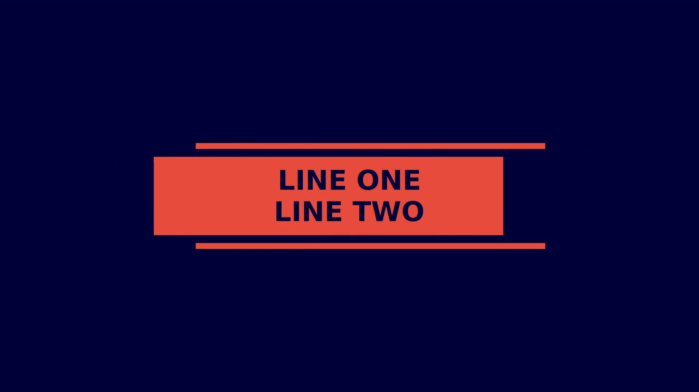

# pixi_title Template

This is a built-in SceneWeaver template for creating pixi_title scenes.

## Usage

```yaml
scenes:
  - type: template
    name: pixi_title
    id: intro_with_image
    duration: 2.5
    with:
      line1: "LINE ONE"
      line2: "LINE TWO"
      background_color: "#00003a"
      accent_color: "#e74c3c" # A nice red

```

## Preview



## Parameters

- `line1` (string): First Line (required)
- `line2` (string): Second Line (required)
- `background_image` (string): Optional path to a background image. (optional)
- `duration` (number): The duration of the scene in seconds. (optional), default: '5'
- `accent_color` (string): The color of the animated overlay shapes. (optional), default: '#3498db'
- `background_color` (string): The background color if no image is provided. (optional), default: '#000000'
- `font` (string): Font family to use (inherited from global settings) (optional), default: 'the global font'
